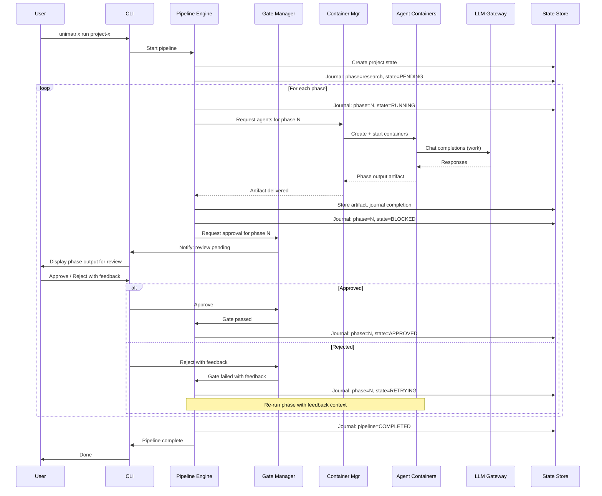

# Agent Orchestration Architectures: Research Report

**Date**: 2026-02-19
**Scope**: Multi-agent orchestration patterns for development workflow automation
**Context**: Unimatrix platform -- orchestrating AI agents across development project phases

---

## Table of Contents

1. [Executive Summary](#executive-summary)
2. [Orchestration Pattern Catalog](#orchestration-pattern-catalog)
3. [Development Phase Pipeline Design](#development-phase-pipeline-design)
4. [Human-in-the-Loop Gate Patterns](#human-in-the-loop-gate-patterns)
5. [Inter-Agent Communication Approaches](#inter-agent-communication-approaches)
6. [Docker Container Orchestration for Agents](#docker-container-orchestration-for-agents)
7. [State Management and Recovery](#state-management-and-recovery)
8. [Rust Ecosystem Assessment for Agent Systems](#rust-ecosystem-assessment-for-agent-systems)
9. [LLM Provider Abstraction Patterns](#llm-provider-abstraction-patterns)
10. [Recommended Architecture for Unimatrix](#recommended-architecture-for-unimatrix)
11. [Implementation Considerations](#implementation-considerations)

---

## Executive Summary

The multi-agent orchestration space has matured rapidly. Gartner reported a 1,445% surge in multi-agent system inquiries from Q1 2024 to Q2 2025, and 72% of enterprise AI projects now involve multi-agent architectures. Four dominant orchestration patterns have emerged -- supervisor/coordinator, pipeline/sequential, event-driven, and hierarchical -- each with distinct trade-offs for reliability, scalability, and complexity.

For Unimatrix's development-phase pipeline (research, architecture, specification, coding, testing, CI/CD), the research points strongly toward a **hybrid architecture**: a **phase-pipeline backbone** with a **supervisor pattern within each phase**, connected by an **event-driven communication layer**, with **human approval gates** between phases. This combines the predictability of sequential pipelines with the flexibility of supervised agent teams and the decoupling benefits of event-driven coordination.

Key findings that shaped this recommendation:

- **Anthropic's own multi-agent research system** demonstrated that an orchestrator-worker pattern with Claude Opus as lead and Claude Sonnet as subagents outperformed single-agent Claude Opus by 90.2% on internal evaluations. However, they also found that multi-agent systems use approximately 15x more tokens than single-agent chats, and that vague task descriptions cause agents to duplicate work or misinterpret tasks.
- **Claude-Flow's reliability failures** provide a cautionary tale: their verification and truth enforcement system broke down, allowing agents to report false successes without consequences, causing cascading failures. This underscores the need for durable state, explicit verification steps, and honest status reporting.
- **Event-driven patterns** (as described by Confluent) offer the strongest foundation for decoupled, fault-tolerant agent coordination, but must be paired with explicit orchestration for development workflows that have strict phase dependencies.
- **Rust's ecosystem** is production-ready for this work: Tokio provides the async runtime, Ractor or Kameo provide actor frameworks, Bollard provides Docker integration, and multiple crates provide LLM provider abstraction.

### Sources

- [Anthropic: How we built our multi-agent research system](https://www.anthropic.com/engineering/multi-agent-research-system)
- [Kore.ai: Choosing the right orchestration pattern](https://www.kore.ai/blog/choosing-the-right-orchestration-pattern-for-multi-agent-systems)
- [Confluent: Four Design Patterns for Event-Driven Multi-Agent Systems](https://www.confluent.io/blog/event-driven-multi-agent-systems/)
- [Microsoft: AI Agent Design Patterns](https://learn.microsoft.com/en-us/azure/architecture/ai-ml/guide/ai-agent-design-patterns)
- [Claude-Flow Issue #640: Verification & Truth Enforcement System Failure](https://github.com/ruvnet/claude-flow/issues/640)

---

## Orchestration Pattern Catalog

### 1. Supervisor/Coordinator-Worker Pattern

A central orchestrator receives requests, decomposes them into subtasks, delegates to specialized worker agents, monitors progress, validates outputs, and synthesizes final results.

```
                    +-----------------+
                    |   Supervisor    |
                    |   (Orchestrator)|
                    +--------+--------+
                             |
              +--------------+--------------+
              |              |              |
        +-----+----+  +-----+----+  +------+-----+
        |  Worker A |  |  Worker B |  |  Worker C  |
        | (Research)|  |  (Code)   |  |  (Test)    |
        +----------+  +----------+  +------------+
```

**Strengths**:
- Predictable control flow; simplified debugging
- Single point of coordination; consistent task delegation
- Well-suited for compliance-heavy workflows
- The supervisor maintains full context of the overall goal

**Weaknesses**:
- Single point of failure (the supervisor itself)
- Potential bottleneck under high concurrency
- Supervisor context window can become saturated with coordination overhead
- All communication routes through the supervisor, adding latency

**Production examples**: LangGraph Supervisor, Microsoft Semantic Kernel, Anthropic's multi-agent research system.

**Key insight from Anthropic**: The lead agent must provide each subagent with a precise objective, explicit output format, guidance on tools/sources, and clear task boundaries. Without these, agents duplicate work or misinterpret tasks.

### 2. Pipeline/Sequential Pattern

A linear sequence of agents where the output of one becomes the input to the next. A manager directs tasks through a fixed, step-by-step sequence.

```
  +----------+     +----------+     +----------+     +----------+
  | Research  | --> | Architect| --> |   Spec   | --> |   Code   |
  |  Agent    |     |  Agent   |     |  Agent   |     |  Agent   |
  +----------+     +----------+     +----------+     +----------+
                                                          |
                                                          v
                                                     +----------+
                                                     |   Test   |
                                                     |  Agent   |
                                                     +----------+
```

**Strengths**:
- Natural fit for workflows with clear phase dependencies
- Easy to reason about; simple state management
- Each agent has well-defined inputs and outputs
- Natural insertion points for human gates between phases

**Weaknesses**:
- No parallelism between phases (though parallelism within a phase is possible)
- A failure in one phase blocks the entire pipeline
- Rigid structure makes it difficult to handle cross-phase dependencies
- Late-stage failures may require re-running the entire pipeline

**Production examples**: CrewAI sequential processes, CI/CD pipelines (GitHub Actions, GitLab CI).

**Relevance to Unimatrix**: This is the natural backbone for development workflow phases. The key question is what happens within each phase.

### 3. Event-Driven Pattern

Agents communicate through domain events published to shared topics/channels rather than calling each other directly. Agents subscribe to events they care about and react asynchronously.

```
  +----------+                                    +----------+
  |  Agent A  |--publish--> [Event Bus / Stream] <--subscribe--|  Agent B  |
  +----------+              |  topic: tasks    |              +----------+
                            |  topic: results  |
  +----------+              |  topic: status   |              +----------+
  |  Agent C  |--publish--> |  topic: errors   | <--subscribe--|  Agent D  |
  +----------+              +------------------+              +----------+
```

**Strengths**:
- Loose coupling between agents; agents can be added/removed without system changes
- Natural fault tolerance; a failing agent does not block others
- Events provide an audit trail and replay capability
- Scales well with increasing numbers of agents

**Weaknesses**:
- Harder to reason about system behavior; potential for event storms
- Eventual consistency -- agents may operate on stale data
- Debugging distributed event flows is difficult
- Requires careful event schema design to avoid coupling through shared data formats

**Production examples**: Confluent (Kafka-based agent coordination), AWS EventBridge agent patterns.

**Four event-driven sub-patterns** (from Confluent):

1. **Orchestrator-Worker (event-driven)**: Central orchestrator publishes task events, workers subscribe and publish results. Same structure as supervisor pattern but decoupled through events.
2. **Hierarchical (event-driven)**: Recursive orchestrator-worker applied at multiple levels. Each non-leaf node orchestrates its subtree via events.
3. **Blackboard**: A shared knowledge base (event topic) where agents post and retrieve information. Agents collaborate asynchronously without direct communication. Especially useful for problems requiring incremental, multi-agent contributions.
4. **Market-Based**: Agents negotiate and compete to allocate tasks. Solver/bidding agents exchange responses over multiple rounds; an aggregator compiles the final answer.

### 4. Hierarchical Agent Teams Pattern

Agents are organized into layers where higher-level agents oversee lower-level agents. Effective for decomposing large problems into progressively smaller, more manageable sub-problems.

```
                         +-------------------+
                         |  Project Director  |
                         +--------+----------+
                                  |
                  +---------------+---------------+
                  |                               |
          +-------+--------+             +--------+-------+
          | Feature Team A  |             | Feature Team B  |
          | (Supervisor)    |             | (Supervisor)    |
          +---+----+----+--+             +---+----+----+--+
              |    |    |                    |    |    |
            +--+ +--+ +--+                +--+ +--+ +--+
            |R | |C | |T |                |R | |C | |T |
            +--+ +--+ +--+                +--+ +--+ +--+
             Research/Code/Test             Research/Code/Test
```

**Strengths**:
- Manages complexity through decomposition
- Teams can work in parallel on different features/components
- Each level of hierarchy has bounded context and responsibility
- Mirrors real software development team structures

**Weaknesses**:
- Communication overhead increases with hierarchy depth
- Risk of information loss as context passes through layers
- Top-level agent must synthesize results from potentially divergent sub-teams
- More complex to implement and debug than flat patterns

**Production examples**: LangGraph hierarchical agent teams, AutoGen nested chat patterns.

### 5. Concurrent/Fan-Out Pattern

Multiple agents work on the same task simultaneously, each providing independent analysis from a different perspective. Results are aggregated.

```
                    +------------------+
                    |   Distributor    |
                    +--------+---------+
                             |
              +--------------+--------------+
              |              |              |
        +-----+----+  +-----+----+  +------+-----+
        | Analyst A |  | Analyst B |  | Analyst C  |
        | (Persp 1) |  | (Persp 2) |  | (Persp 3)  |
        +-----+----+  +-----+----+  +------+-----+
              |              |              |
              +--------------+--------------+
                             |
                    +--------+---------+
                    |   Aggregator     |
                    +------------------+
```

**Strengths**:
- Faster time to result through parallelism
- Multiple perspectives reduce blind spots
- Asking one agent to review another's work produces better results than self-review

**Weaknesses**:
- Higher token consumption (Anthropic reports 15x tokens vs single-agent chat)
- Risk of duplicated work without clear task boundaries
- Aggregation is non-trivial; synthesizing conflicting conclusions requires judgment

**Relevance to Unimatrix**: Useful within phases (e.g., multiple research agents investigating different aspects of an architecture question) but should not be the primary orchestration model for cross-phase coordination.

### Pattern Selection Matrix

| Pattern | Best For | Predictability | Scalability | Fault Tolerance | Complexity |
|---------|----------|---------------|-------------|-----------------|------------|
| Supervisor | Coordinated workflows | High | Medium | Low (SPOF) | Medium |
| Pipeline | Phase-dependent flows | Very High | Low | Low | Low |
| Event-Driven | Decoupled, async work | Medium | High | High | High |
| Hierarchical | Large decomposable problems | Medium | High | Medium | High |
| Concurrent | Multi-perspective analysis | Low | High | High | Medium |

---

## Development Phase Pipeline Design

### Phase Model

Unimatrix's development workflow maps naturally to a phase pipeline with human gates:

```
  +-----------+    +Gate+    +-----------+    +Gate+    +-----------+
  | RESEARCH  | -->| H1 |--> |ARCHITECTURE| -->| H2 |--> |   SPEC    |
  |           |    +----+    |           |    +----+    |           |
  +-----------+              +-----------+              +-----------+
                                                             |
                                                         +Gate+
                                                         | H3 |
                                                         +----+
                                                             |
  +-----------+    +Gate+    +-----------+    +Gate+    +----v------+
  |   CI/CD   | <--| H5 |<-- |  TESTING  | <--| H4 |<-- |  CODING   |
  |           |    +----+    |           |    +----+    |           |
  +-----------+              +-----------+              +-----------+
```

### Phase Definitions

Each phase has a defined **entry contract** (required inputs), **exit contract** (required outputs), and **internal orchestration pattern**:

#### Phase 1: Research
- **Entry**: Project brief, existing codebase context, constraints
- **Internal pattern**: Fan-out/concurrent (multiple research agents explore different facets)
- **Exit**: Research report with findings, recommendations, and open questions
- **Gate H1**: Human reviews research completeness, validates direction

#### Phase 2: Architecture
- **Entry**: Validated research report, project constraints
- **Internal pattern**: Supervisor with specialist workers (system design agent, API design agent, data model agent)
- **Exit**: Architecture decision records, system design document, component diagram
- **Gate H2**: Human reviews architecture for correctness, alignment with constraints

#### Phase 3: Specification
- **Entry**: Approved architecture documents
- **Internal pattern**: Supervisor with workers (spec writer agent, API spec agent, schema agent)
- **Exit**: Detailed technical specifications, API contracts, data schemas
- **Gate H3**: Human validates spec completeness, edge cases, acceptance criteria

#### Phase 4: Coding
- **Entry**: Approved specifications
- **Internal pattern**: Hierarchical teams (one supervisor per module/component, worker agents for implementation)
- **Exit**: Implemented code, inline documentation, initial unit tests
- **Gate H4**: Human code review (may be assisted by review agent)

#### Phase 5: Testing
- **Entry**: Implemented code with passing unit tests
- **Internal pattern**: Concurrent (integration test agent, performance test agent, security scan agent)
- **Exit**: Test results, coverage report, identified issues
- **Gate H5**: Human reviews test coverage and results

#### Phase 6: CI/CD
- **Entry**: Code with passing tests
- **Internal pattern**: Pipeline (build agent -> deploy agent -> smoke test agent)
- **Exit**: Deployed artifact, deployment verification

### Phase State Machine

Each phase follows a well-defined state machine:

```
                  +----------+
                  |  PENDING  |
                  +-----+----+
                        |
                        v
                  +----------+
          +-----> | RUNNING  | <-----+
          |       +-----+----+       |
          |             |            |
          |        +----+----+       |
          |        |         |       |
          |        v         v       |
     +----+----+  +---+  +--+---+   |
     | RETRYING|  |   |  |BLOCKED|  |
     +---------+  |   |  |(gate) |  |
                  |   |  +--+----+  |
                  |   |     |       |
                  v   |     v       |
            +-----+--++ +--+----+  |
            | FAILED  | |APPROVED+--+
            +---------+ +-------+
                  |
                  v
            +---------+
            |COMPLETED|
            +---------+
```

States:
- **PENDING**: Phase is queued, waiting for prerequisite phase completion
- **RUNNING**: Agents are actively working within the phase
- **BLOCKED**: Phase work is complete, awaiting human gate approval
- **APPROVED**: Human has approved; triggering the next phase
- **RETRYING**: Phase is re-running after a failure or rejection
- **FAILED**: Phase has exhausted retries or encountered an unrecoverable error
- **COMPLETED**: Phase output has been approved and consumed by the next phase

### Cross-Phase Artifact Flow

Artifacts produced in each phase become the primary context for the next phase. This is where context engineering becomes critical:

```
Research Report
    |
    v
Architecture Decision Records + System Design
    |
    v
Technical Specifications + API Contracts + Schemas
    |
    v
Source Code + Unit Tests
    |
    v
Test Results + Coverage + Issue Reports
    |
    v
Build Artifacts + Deployment Records
```

Each artifact must be:
1. **Structured**: Machine-parseable format (not just prose)
2. **Versioned**: Tied to specific phase execution runs
3. **Summarizable**: Agents in subsequent phases need compressed context, not raw dumps
4. **Validated**: Schema-validated before being passed to the next phase

---

## Human-in-the-Loop Gate Patterns

### Pattern Taxonomy

Based on current production patterns, there are four primary HITL approaches:

#### 1. Pre-Action Approval Gate (Recommended for Unimatrix Phase Gates)

The agent completes a unit of work and places it in a holding state. It cannot proceed until a human signal is received.

```
  Agent completes phase work
           |
           v
  +------------------+
  | Output placed in  |
  | review queue       |
  +--------+---------+
           |
           v
  Human reviews output
           |
     +-----+------+
     |            |
  APPROVE      REJECT
     |            |
     v            v
  Next phase   Agent revises
  begins       with feedback
```

**Implementation**: The system persists the phase output, transitions the phase state to BLOCKED, and sends a notification (webhook, email, Slack, CLI prompt). The human reviews the output and submits an APPROVE or REJECT with optional feedback. On approval, the state machine transitions to APPROVED and the next phase begins. On rejection, the feedback is injected into the agent's context and the phase re-runs.

#### 2. Escalation Trigger (Confidence-Based)

Agents operate autonomously by default but escalate to a human when confidence drops below a threshold.

```
  Agent working autonomously
           |
     confidence >= threshold?
     +-----+------+
     | YES         | NO
     v             v
  Continue     Escalate to
  autonomously   human
```

**Use in Unimatrix**: This pattern is valuable within phases. For example, a coding agent that encounters an ambiguous specification can escalate rather than guessing. The escalation threshold should be configurable per project and per phase.

#### 3. Two-Person Approval (High-Stakes Gates)

For critical transitions (e.g., architecture approval, production deployment), require approval from two independent reviewers.

**Use in Unimatrix**: Appropriate for the architecture gate (H2) and CI/CD gate (H5) in production environments.

#### 4. Post-Action Review (Sampling)

A human samples a percentage of agent outputs after the fact, providing corrections that feed back into future agent behavior.

**Use in Unimatrix**: Useful for building trust over time. As the system proves reliable, some gates can transition from pre-action approval to post-action sampling.

### Trust Escalation Model

Over time, as the system demonstrates reliability, gate requirements can be relaxed:

```
Level 0: All gates require explicit human approval (initial deployment)
Level 1: Research and Testing gates become post-action review
Level 2: Specification gates become confidence-based escalation
Level 3: Only Architecture and CI/CD gates remain pre-action approval
Level 4: All gates become confidence-based (full autonomous mode)
```

The trust level should be:
- **Per-project**: A well-established project with stable conventions earns trust faster
- **Per-phase**: Coding phases may earn trust slower than research phases
- **Reversible**: A series of failures should automatically reduce trust level
- **Auditable**: Every gate decision (human or automated) must be logged

### Gate Implementation Requirements

1. **Notification system**: Webhooks, Slack integration, CLI notifications
2. **Review interface**: Present phase outputs in a structured, reviewable format
3. **Feedback mechanism**: Allow humans to provide structured feedback on rejections
4. **Timeout handling**: Configurable timeouts for gate reviews (with escalation)
5. **Delegation**: Allow gate reviewers to delegate to other humans
6. **Audit log**: Every gate interaction must be recorded with timestamp, reviewer, decision, and rationale

---

## Inter-Agent Communication Approaches

### Approach Comparison

| Approach | Coupling | Latency | Reliability | Complexity | Best For |
|----------|---------|---------|-------------|------------|----------|
| Direct RPC/gRPC | Tight | Low | Medium | Low | Intra-phase, high-frequency |
| Message Queue | Loose | Medium | High | Medium | Cross-phase, async tasks |
| Event Bus | Very Loose | Medium | High | High | System-wide notifications |
| Shared State | Medium | Low | Medium | Medium | Collaborative data access |
| Blackboard | Medium | Low | Medium | Medium | Incremental problem solving |

### Recommended Hybrid Approach

For Unimatrix, a layered communication strategy:

```
  +-------------------------------------------------------+
  |                  Event Bus (system-wide)                |
  |  Phase transitions, gate events, error notifications   |
  +-------------------------------------------------------+
                          |
  +-------------------------------------------------------+
  |              Message Queue (cross-phase)                |
  |  Artifact delivery, task assignment, results            |
  +-------------------------------------------------------+
                          |
  +-------------------------------------------------------+
  |           Direct Channels (intra-phase)                 |
  |  Supervisor <-> worker communication within a phase    |
  +-------------------------------------------------------+
                          |
  +-------------------------------------------------------+
  |             Shared State Store                          |
  |  Project context, configuration, accumulated artifacts  |
  +-------------------------------------------------------+
```

#### Layer 1: Event Bus (System-Wide)

All significant system events are published to a central event bus:

- `phase.started`, `phase.completed`, `phase.failed`
- `gate.pending`, `gate.approved`, `gate.rejected`
- `agent.spawned`, `agent.completed`, `agent.failed`
- `artifact.produced`, `artifact.validated`

Any component can subscribe to these events. This provides observability, enables the UI to show real-time status, and allows for future extensibility (e.g., adding a monitoring agent that watches for patterns of failure).

**Implementation in Rust**: Tokio's `broadcast` channel for in-process events, with optional bridge to external event systems (Redis Streams, NATS) for distributed deployments.

#### Layer 2: Message Queue (Cross-Phase)

Artifacts and task assignments flow through a durable message queue:

- Phase N produces artifacts and publishes them to a queue
- Phase N+1 consumes artifacts from the queue when it starts
- Messages are persisted to survive restarts

**Implementation in Rust**: Tokio `mpsc` channels for in-process, with optional bridge to Redis Streams or NATS JetStream for persistence and distributed operation.

#### Layer 3: Direct Channels (Intra-Phase)

Within a phase, the supervisor communicates with workers through direct channels:

- Supervisor sends task assignments via `mpsc` channels
- Workers return results via `oneshot` channels (request-response pattern)
- Supervisor can broadcast instructions to all workers via `broadcast` channels

**Implementation in Rust**: Tokio channel primitives (`mpsc`, `oneshot`, `broadcast`, `watch`).

#### Layer 4: Shared State Store

Project-level context that all agents need access to:

- Project configuration and conventions
- Accumulated artifacts from previous phases
- Agent capabilities registry
- Current system state

**Implementation in Rust**: `Arc<RwLock<T>>` for in-process shared state, with optional persistence to SQLite or PostgreSQL. The `watch` channel is useful for broadcasting state changes (e.g., updated configuration).

### Protocol Considerations

**Google's A2A Protocol** (Agent2Agent) is an emerging open standard (backed by 150+ organizations including Microsoft, Salesforce, and SAP) for agent-to-agent communication. It defines:
- **Agent Cards**: JSON-format capability discovery
- **Task lifecycle management**: Defined states for task tracking
- **Context sharing**: Standardized instruction and context exchange
- **Transport**: HTTPS + JSON-RPC 2.0, with gRPC support added in v0.3

While A2A is designed for cross-organization agent interoperability, Unimatrix's internal agents do not need this level of formality. However, adopting A2A-compatible agent cards for capability discovery and A2A-style task lifecycle states would provide a future path to interoperability with external agent systems.

**Anthropic's MCP (Model Context Protocol)** is relevant for tool integration -- giving agents access to external tools and data sources through a standardized protocol. Unimatrix agents should use MCP for tool access (file systems, APIs, databases) rather than inventing custom tool interfaces.

---

## Docker Container Orchestration for Agents

### Container Architecture

Each agent runs in an isolated Docker container, providing:
- **Security isolation**: Agents cannot access host resources or other agents' filesystems
- **Reproducibility**: Identical environment regardless of host OS
- **Resource limits**: CPU and memory constraints per agent
- **Clean teardown**: No state leaks between agent runs

### Container Topology

```
  +------------------------------------------------------------------+
  |  Host / VM                                                        |
  |                                                                   |
  |  +--------------------+    +--------------------+                 |
  |  | Unimatrix Core     |    | Shared Services    |                 |
  |  | (Rust binary)      |    | - Redis/NATS       |                 |
  |  | - Orchestrator     |    | - SQLite/Postgres  |                 |
  |  | - State Machine    |    | - File Store       |                 |
  |  | - Gate Manager     |    +--------------------+                 |
  |  | - Docker Manager   |                                           |
  |  +--------+-----------+                                           |
  |           |                                                       |
  |           | Docker API (via Bollard)                               |
  |           |                                                       |
  |  +--------v-----------+  +-------------------+  +---------------+ |
  |  | Agent Container 1  |  | Agent Container 2 |  | Agent Cont. N | |
  |  | - LLM Client       |  | - LLM Client      |  | - LLM Client  | |
  |  | - Tool Access (MCP)|  | - Tool Access     |  | - Tool Access | |
  |  | - Workspace Mount  |  | - Workspace Mount |  | - Workspace   | |
  |  +--------------------+  +-------------------+  +---------------+ |
  +------------------------------------------------------------------+
```

### Container Lifecycle Management

Using Bollard (Rust Docker API client), Unimatrix manages agent containers through their full lifecycle:

```
  CREATE --> START --> MONITOR --> (EXEC commands) --> STOP --> REMOVE
     |                   |
     |                   +-- Health checks
     |                   +-- Log streaming
     |                   +-- Resource monitoring
     +-- Image selection
     +-- Volume mounts
     +-- Network config
     +-- Resource limits
```

#### Container Creation

Each agent container is created with:
- **Base image**: A pre-built image containing the agent runtime, LLM client libraries, and common tools
- **Volume mounts**: Read-only mount for project source code; read-write mount for agent workspace
- **Environment variables**: LLM API keys, project configuration, phase parameters
- **Network**: Isolated Docker network with access only to the orchestrator and shared services
- **Resource limits**: CPU cores, memory limit, disk quota

#### Container Monitoring

The orchestrator monitors agent containers via:
- **Health checks**: Periodic heartbeat from the agent process
- **Log streaming**: Real-time capture of agent stdout/stderr via Bollard's log streaming API
- **Resource usage**: Docker stats API for CPU/memory/disk monitoring
- **Exit detection**: Container exit code monitoring for unexpected termination

#### Container Pools

For performance, maintain a pool of pre-warmed containers:
- Containers are created and started with the agent runtime but no active task
- When a phase needs agents, it claims containers from the pool
- After task completion, containers are cleaned and returned to the pool (or destroyed if tainted)
- Pool size is configurable per phase type

### Docker Compose for Local Development

For local-first development, a Docker Compose configuration defines the full stack:

```yaml
# Conceptual structure (not final implementation)
services:
  unimatrix-core:
    build: ./core
    volumes:
      - /var/run/docker.sock:/var/run/docker.sock  # Docker-in-Docker access
      - ./projects:/projects:ro
    environment:
      - LLM_PROVIDER=anthropic
      - LLM_API_KEY=${ANTHROPIC_API_KEY}

  redis:
    image: redis:7-alpine
    # Event bus and message queue backing store

  # Agent containers are created dynamically by unimatrix-core
  # via Bollard, not defined in compose
```

### Cloud Portability

The same architecture maps to cloud environments:
- **Local**: Docker Engine + Docker Compose
- **Single server**: Docker Engine (same as local)
- **Kubernetes**: Replace Bollard with k8s API client; agents become Pods
- **Cloud Run / ECS / ACI**: Replace Bollard with cloud-specific container APIs

The abstraction layer should be a `ContainerRuntime` trait:

```rust
#[async_trait]
trait ContainerRuntime {
    async fn create_agent(&self, config: AgentConfig) -> Result<AgentHandle>;
    async fn start_agent(&self, handle: &AgentHandle) -> Result<()>;
    async fn stop_agent(&self, handle: &AgentHandle) -> Result<()>;
    async fn remove_agent(&self, handle: &AgentHandle) -> Result<()>;
    async fn exec_in_agent(&self, handle: &AgentHandle, cmd: &str) -> Result<ExecOutput>;
    async fn stream_logs(&self, handle: &AgentHandle) -> Result<LogStream>;
    async fn health_check(&self, handle: &AgentHandle) -> Result<HealthStatus>;
}
```

With implementations: `DockerRuntime` (Bollard), `KubernetesRuntime` (kube-rs), `LocalProcessRuntime` (for testing without Docker).

---

## State Management and Recovery

### State Persistence Requirements

Multi-agent systems face unique state management challenges:

1. **Phase state**: Which phase is active, what has been approved, what artifacts exist
2. **Agent state**: Which agents are running, their current task, their accumulated context
3. **Artifact state**: What has been produced, validated, and consumed
4. **Gate state**: Which gates are pending, who was notified, timeout status
5. **Conversation state**: LLM conversation history for each agent (for resume after failure)

### Durable Execution Model

Drawing from Restate and Temporal patterns, Unimatrix should implement durable execution:

```
  Agent performs action
         |
         v
  Action is journaled to durable log BEFORE execution
         |
         v
  Action executes
         |
     +---+---+
     |       |
  Success  Failure
     |       |
     v       v
  Journal   Journal records failure
  records   System can replay from
  success   last successful action
```

**Key principles**:
- Every state transition is journaled before it takes effect
- On recovery, the system replays the journal to reconstruct state
- Idempotent operations ensure replay produces the same result
- Checkpoints reduce replay time for long-running phases

### Failure Taxonomy and Recovery Strategies

| Failure Type | Example | Recovery Strategy |
|-------------|---------|-------------------|
| Transient LLM error | API timeout, rate limit | Retry with exponential backoff + jitter |
| Agent crash | OOM, panic | Restart container, replay from last checkpoint |
| Phase failure | Agent produces invalid output | Re-run phase with error context |
| Orchestrator crash | Host restart | Recover from journal, resume in-progress phases |
| Gate timeout | Human does not respond | Escalate notification, extend timeout |
| Cascading failure | Multiple agents fail simultaneously | Circuit breaker, pause system, alert human |

### Recovery Implementation Patterns

#### Exponential Backoff with Jitter

For transient failures (LLM API errors, rate limits):

```
delay = min(base_delay * 2^attempt + random_jitter, max_delay)
```

Typical values: base_delay = 1s, max_delay = 60s, max_attempts = 5.

#### Circuit Breaker

Prevents repeated execution of failing operations:

```
  CLOSED (normal) --[failure threshold]--> OPEN (blocking)
       ^                                       |
       |                                  [timeout]
       |                                       |
       +------[success]------ HALF-OPEN <------+
                              (test one request)
```

Applied to: LLM provider calls, Docker API calls, external service calls.

#### Checkpointing

Periodic snapshots of agent state to reduce recovery time:

- **Phase-level checkpoints**: After each significant sub-task within a phase
- **Agent-level checkpoints**: Conversation history + accumulated context
- **System-level checkpoints**: Full system state for disaster recovery

Storage: SQLite for local deployments, PostgreSQL for cloud deployments.

#### Supervision Trees (Erlang-Style)

Borrowing from Erlang/OTP (and Rust's Ractor framework):

```
  +-------------------+
  | System Supervisor  |
  +--------+----------+
           |
   +-------+--------+
   |                 |
  Phase           Service
  Supervisor      Supervisor
   |                 |
  Agent            Redis
  Supervisor       Health
   |                Monitor
  Worker
  Agents
```

Each supervisor level has a restart strategy:
- **One-for-one**: Restart only the failed child
- **One-for-all**: Restart all children if one fails
- **Rest-for-one**: Restart the failed child and all children started after it

### State Store Design

```
  +--------------------------------------------------+
  |  State Store                                       |
  |                                                    |
  |  projects/                                         |
  |    {project_id}/                                   |
  |      config.toml          # Project configuration  |
  |      state.json           # Current pipeline state |
  |      phases/                                       |
  |        {phase_id}/                                 |
  |          state.json       # Phase state            |
  |          journal.log      # Durable execution log  |
  |          artifacts/       # Phase outputs          |
  |          agents/                                   |
  |            {agent_id}/                             |
  |              state.json   # Agent state            |
  |              history.json # Conversation history   |
  |              checkpoint/  # Latest checkpoint      |
  +--------------------------------------------------+
```

---

## Rust Ecosystem Assessment for Agent Systems

### Async Runtime: Tokio

**Tokio** is the clear choice for async runtime. It is the de facto standard in the Rust ecosystem, with the broadest library support and most mature implementation.

- Provides `mpsc`, `oneshot`, `broadcast`, and `watch` channels for inter-task communication
- Supports task spawning, timers, I/O, and synchronization primitives
- Proven at scale in production systems

No other async runtime (async-std, smol) has comparable ecosystem support.

### Actor Frameworks

Five major Rust actor frameworks were evaluated (based on early 2025 benchmarks):

| Framework | Tokio-Based | Distribution | Performance | Supervision Trees | Maturity |
|-----------|------------|-------------|-------------|-------------------|----------|
| **Actix** | Custom (Tokio-based) | Via extensions | Fastest | No built-in | High |
| **Ractor** | Yes (also async-std) | Built-in | Good | Yes (Erlang-style) | Medium |
| **Kameo** | Yes | Built-in | Good | Yes | Medium |
| **Coerce** | Yes | Built-in | Good | Partial | Medium |
| **Xtra** | Yes | No | Good | No | Medium |

**Recommendation: Ractor**

Ractor is the strongest fit for Unimatrix because:
1. It provides Erlang-style supervision trees, which map directly to our agent hierarchy
2. Built-in distribution support for future multi-node deployment
3. Tokio-native; integrates cleanly with the rest of the ecosystem
4. Active development and growing adoption
5. Typed message passing aligns with Rust's safety guarantees

Actix has faster raw messaging, but Ractor's supervision tree support is critical for agent lifecycle management and fault recovery. If benchmarking reveals Ractor's messaging overhead is a bottleneck (unlikely for LLM-bound workloads), Actix could be evaluated as an alternative.

### Docker Integration: Bollard

**Bollard** is the standard Rust client for the Docker API:
- Async/await API built on Tokio and Hyper
- Full container lifecycle management (create, start, stop, remove, exec)
- Log streaming and event monitoring
- Windows (Named Pipes) and Linux (Unix sockets) support
- HTTPS support via Rustls

No other Rust Docker client comes close in completeness or maintenance.

### Workflow / State Machine Libraries

| Library | Description | Fit for Unimatrix |
|---------|-------------|-------------------|
| **Orka** | Type-safe async workflow engine | Good for phase pipeline |
| **Restate** | Durable execution engine (Rust binary) | Excellent but adds infrastructure dependency |
| **Acts** | YAML-based workflow engine | Too limited for dynamic agent orchestration |

**Recommendation**: Build a custom state machine for the phase pipeline using Rust enums and pattern matching. The phase state machine is simple enough (7 states, ~10 transitions) that a library adds unnecessary dependency. Use Orka patterns as inspiration for the workflow structure.

For durable execution (journaling, replay), implement a custom journal backed by SQLite rather than adopting Restate as a dependency. This keeps the system self-contained while providing the critical recovery capability.

### Serialization and Storage

| Crate | Purpose |
|-------|---------|
| **serde** + **serde_json** | JSON serialization for artifacts, state, messages |
| **toml** | Configuration file parsing |
| **sqlx** | Async database access (SQLite + PostgreSQL) |
| **rusqlite** | Synchronous SQLite (for simple state persistence) |

### HTTP and Networking

| Crate | Purpose |
|-------|---------|
| **reqwest** | HTTP client for LLM API calls |
| **axum** | HTTP server for gate review UI and API |
| **tower** | Middleware (rate limiting, retry, timeout) for HTTP |
| **tonic** | gRPC (if needed for high-performance inter-agent communication) |

### CLI and User Interface

| Crate | Purpose |
|-------|---------|
| **clap** | Command-line argument parsing |
| **ratatui** | Terminal UI for real-time monitoring |
| **tracing** | Structured logging and distributed tracing |
| **indicatif** | Progress bars for phase execution |

### Testing

| Crate | Purpose |
|-------|---------|
| **tokio::test** | Async test runtime |
| **testcontainers** | Docker-based integration tests |
| **wiremock** | Mock HTTP servers for LLM API testing |
| **proptest** | Property-based testing for state machine transitions |

---

## LLM Provider Abstraction Patterns

### Abstraction Requirements

Unimatrix must support multiple LLM providers while defaulting to Claude:
- **Provider switching**: Swap between Claude, OpenAI, local models (Ollama) without code changes
- **Model selection**: Different models for different roles (e.g., Opus for lead agent, Sonnet for workers)
- **Fallback chains**: If primary provider fails, fall back to secondary
- **Cost management**: Track token usage per agent, per phase, per project
- **Streaming**: Support streaming responses for real-time output

### Rust Crate Landscape

Several Rust crates provide multi-provider LLM abstraction:

| Crate | Providers | Streaming | Maturity |
|-------|-----------|-----------|----------|
| **llm** (graniet) | 12+ (OpenAI, Claude, Gemini, Ollama, etc.) | Yes | Active, growing |
| **llm-connector** | 11+ providers | Yes (universal) | Active |
| **turbine-llm** | OpenAI, Claude, Gemini, Groq | Yes | Newer |
| **rsllm** | OpenAI, Claude, Ollama | Limited | Smaller |

### Recommended Abstraction Design

Rather than depending on an external crate that may not match our exact needs, implement a thin abstraction layer:

```rust
/// Core trait for LLM providers
#[async_trait]
pub trait LlmProvider: Send + Sync {
    /// Send a chat completion request
    async fn chat(&self, request: ChatRequest) -> Result<ChatResponse>;

    /// Send a streaming chat completion request
    async fn chat_stream(&self, request: ChatRequest) -> Result<ChatStream>;

    /// List available models
    async fn list_models(&self) -> Result<Vec<ModelInfo>>;

    /// Get provider name for logging/metrics
    fn provider_name(&self) -> &str;
}

/// Provider-agnostic chat request
pub struct ChatRequest {
    pub model: String,
    pub messages: Vec<Message>,
    pub system_prompt: Option<String>,
    pub temperature: Option<f32>,
    pub max_tokens: Option<u32>,
    pub tools: Vec<ToolDefinition>,
    pub metadata: RequestMetadata,  // For tracking/billing
}

/// Provider-agnostic message
pub struct Message {
    pub role: Role,  // System, User, Assistant, Tool
    pub content: Vec<ContentBlock>,  // Text, Image, ToolUse, ToolResult
}

/// Provider implementations
pub struct AnthropicProvider { /* ... */ }
pub struct OpenAiProvider { /* ... */ }
pub struct OllamaProvider { /* ... */ }

/// Provider with fallback chain
pub struct FallbackProvider {
    primary: Box<dyn LlmProvider>,
    fallbacks: Vec<Box<dyn LlmProvider>>,
}

/// Provider with cost tracking
pub struct MeteredProvider {
    inner: Box<dyn LlmProvider>,
    meter: TokenMeter,
}
```

### Model Selection Strategy

Different agent roles warrant different models:

| Role | Default Model | Rationale |
|------|--------------|-----------|
| Phase Supervisor | Claude Opus / GPT-4o | Needs strong reasoning for task decomposition |
| Research Agent | Claude Sonnet / GPT-4o-mini | Balance of quality and cost for information gathering |
| Code Agent | Claude Sonnet | Strong coding performance |
| Review Agent | Claude Opus | Needs deep reasoning for code review |
| Test Agent | Claude Sonnet | Standard task execution |
| Spec Agent | Claude Sonnet | Structured output generation |

Model selection should be configurable per project, per phase, and per agent role through a configuration hierarchy:

```toml
[llm.defaults]
provider = "anthropic"
supervisor_model = "claude-opus-4"
worker_model = "claude-sonnet-4"

[llm.overrides.coding]
worker_model = "claude-sonnet-4"  # Coding-optimized

[llm.fallback]
provider = "openai"
supervisor_model = "gpt-4o"
worker_model = "gpt-4o-mini"
```

---

## Recommended Architecture for Unimatrix

### Architecture Overview

Based on all research findings, the recommended architecture is a **phase-pipeline with supervised agent teams, event-driven coordination, and durable execution**:

```
+========================================================================+
|  UNIMATRIX CORE (Rust binary)                                          |
|                                                                        |
|  +-------------------+  +------------------+  +---------------------+  |
|  | Pipeline Engine   |  | Gate Manager     |  | Container Manager   |  |
|  | - Phase state     |  | - Approval flow  |  | - Agent lifecycle   |  |
|  |   machine         |  | - Notifications  |  | - Health monitoring |  |
|  | - Artifact flow   |  | - Trust levels   |  | - Resource limits   |  |
|  | - Dependency      |  | - Audit log      |  | - Container pools   |  |
|  |   tracking        |  |                  |  |                     |  |
|  +--------+----------+  +--------+---------+  +----------+----------+  |
|           |                      |                       |             |
|  +--------v----------------------v-----------------------v----------+  |
|  |                        Event Bus                                 |  |
|  |  (Tokio broadcast channels + optional Redis Streams bridge)      |  |
|  +------------------------------------------------------------------+  |
|           |                      |                       |             |
|  +--------v----------+  +-------v--------+  +-----------v---------+   |
|  | State Store       |  | LLM Gateway    |  | Artifact Store      |   |
|  | - SQLite/Postgres |  | - Provider     |  | - Phase outputs     |   |
|  | - Journal log     |  |   abstraction  |  | - Versioned         |   |
|  | - Checkpoints     |  | - Fallback     |  | - Schema-validated  |   |
|  |                   |  | - Metering     |  |                     |   |
|  +-------------------+  +----------------+  +---------------------+   |
|                                                                        |
+========================================================================+
         |                                              |
         | Docker API (Bollard)                         | HTTP API (Axum)
         |                                              |
+--------v---------+  +----------+  +----------+   +---v-----------+
| Agent Container  |  | Agent    |  | Agent    |   | CLI / Web UI  |
| (Phase: Research)|  | Cont.   |  | Cont.   |   | - Gate review  |
| - Supervisor     |  | (Code)  |  | (Test)  |   | - Status       |
| - Workers (N)    |  |         |  |         |   | - Config       |
+------------------+  +---------+  +---------+   +-----------------+
```

### Component Responsibilities

#### Pipeline Engine
- Owns the phase state machine for each project
- Manages phase ordering, dependencies, and transitions
- Triggers phase execution by requesting agents from the Container Manager
- Routes artifacts between phases through the Artifact Store
- Implements durable execution (journaling, checkpointing, replay)

#### Gate Manager
- Manages human-in-the-loop approval gates between phases
- Sends notifications when gates are pending
- Receives approval/rejection decisions
- Implements trust escalation logic
- Maintains audit log of all gate decisions

#### Container Manager
- Creates, starts, monitors, and stops agent containers via Bollard
- Manages container pools for performance
- Enforces resource limits
- Streams agent logs to the observability system
- Implements the `ContainerRuntime` trait for portability

#### Event Bus
- Central nervous system for all system events
- In-process: Tokio `broadcast` channels
- Distributed: Bridge to Redis Streams or NATS
- All components publish and subscribe to relevant events

#### State Store
- Durable storage for all system state
- Phase states, agent states, gate states
- Execution journal for recovery
- SQLite for local; PostgreSQL for cloud

#### LLM Gateway
- Abstracts LLM provider details from agents
- Implements provider fallback chains
- Tracks token usage and costs
- Rate limiting and circuit breaking

#### Artifact Store
- Versioned storage for phase outputs
- Schema validation on write
- Summarization for context management
- Content-addressable for deduplication

### Intra-Phase Architecture

Within each phase, the supervisor pattern governs agent coordination:

```
  +------------------------------------------+
  | Phase Container Cluster                   |
  |                                           |
  |  +------------------+                     |
  |  | Phase Supervisor  |                     |
  |  | (Ractor Actor)    |                     |
  |  +--------+---------+                     |
  |           |                               |
  |    +------+------+------+                 |
  |    |      |      |      |                 |
  |  +-v-+  +-v-+  +-v-+  +-v-+              |
  |  |W1 |  |W2 |  |W3 |  |W4 |              |
  |  +---+  +---+  +---+  +---+              |
  |  Worker Agents (Ractor Actors)            |
  |                                           |
  |  Communication: Ractor typed messages     |
  |  Supervision: One-for-one restart         |
  +------------------------------------------+
```

The phase supervisor:
1. Receives the phase input (artifacts from the previous phase + project context)
2. Decomposes the work into specific, well-bounded tasks with explicit instructions
3. Assigns tasks to worker agents
4. Monitors worker progress and handles failures
5. Validates worker outputs against the phase exit contract
6. Synthesizes the phase output artifact
7. Publishes the artifact and transitions the phase to BLOCKED (awaiting gate)

### Data Flow: Complete Pipeline Execution



### Technology Stack Summary

| Component | Technology | Rationale |
|-----------|-----------|-----------|
| Language | Rust | Performance, safety, single binary deployment |
| Async Runtime | Tokio | De facto standard, broadest ecosystem |
| Actor Framework | Ractor | Supervision trees, Tokio-native, typed messages |
| Docker Client | Bollard | Only mature async Docker API for Rust |
| HTTP Server | Axum | Modern, Tower-based, excellent ergonomics |
| HTTP Client | Reqwest | Standard, async, TLS support |
| Database | SQLx + SQLite (local) / PostgreSQL (cloud) | Async, compile-time checked queries |
| Serialization | Serde + serde_json | Universal standard in Rust |
| CLI | Clap | De facto standard for CLI parsing |
| Logging | Tracing | Structured, async-aware, spans for distributed tracing |
| TUI | Ratatui | Real-time terminal monitoring |
| Testing | tokio::test + testcontainers + wiremock | Async tests, container tests, mock LLM APIs |

---

## Implementation Considerations

### 1. Context Engineering is the Hardest Problem

Anthropic's experience shows that the quality of agent output is directly proportional to the quality of context provided. Key practices:

- **Explicit, detailed task descriptions**: Every worker agent needs a precise objective, output format, tool guidance, and clear task boundaries. Vague instructions cause duplication and misinterpretation.
- **Semantic compression**: Raw artifacts from previous phases must be summarized before being injected into agent context. A 50-page architecture document should become a 2-page summary for the coding agent.
- **Context budgeting**: With limited context windows, each agent should receive only the information relevant to its specific task, not the entire project history.
- **Cross-agent review**: Having one agent review another's work produces better results than self-review. Build this into the phase supervisor logic.

### 2. Start Simple, Add Complexity Incrementally

The recommended implementation order:

1. **Phase 1**: Single-agent pipeline with manual gates (no supervisor pattern, no parallelism)
2. **Phase 2**: Add supervisor-worker within phases (still sequential phases)
3. **Phase 3**: Add event bus and observability
4. **Phase 4**: Add container isolation (move agents from in-process to Docker)
5. **Phase 5**: Add durable execution (journaling, checkpointing)
6. **Phase 6**: Add trust escalation and advanced gate logic
7. **Phase 7**: Add distributed deployment support

### 3. Token Cost Management

Multi-agent systems are expensive. Anthropic reports 15x token usage compared to single-agent chat. Mitigation strategies:

- Use cheaper models (Sonnet, GPT-4o-mini) for worker agents; reserve expensive models (Opus) for supervisors and reviewers
- Implement aggressive context summarization between phases
- Cache common tool results and intermediate computations
- Set per-phase and per-project token budgets with alerts
- Track and report cost breakdowns in the CLI output

### 4. Testing Strategy

Testing multi-agent systems requires multiple approaches:

- **Unit tests**: Individual agent logic, state machine transitions, artifact validation
- **Integration tests**: Phase execution with mocked LLM responses (wiremock)
- **Container tests**: Full pipeline execution with testcontainers
- **Replay tests**: Record LLM interactions, replay for regression testing
- **Property tests**: State machine invariants (proptest)
- **Chaos tests**: Inject failures (agent crash, LLM timeout, Docker failure) and verify recovery

### 5. Observability

Without strong observability, debugging multi-agent systems is nearly impossible:

- **Structured logging**: Every agent action logged with trace IDs linking to phase and project
- **Distributed tracing**: Spans across agent-to-supervisor-to-pipeline for end-to-end visibility
- **Metrics**: Token usage, phase duration, agent success/failure rates, gate approval times
- **Event replay**: Ability to replay the event stream to understand what happened
- **Dashboard**: Real-time TUI showing pipeline status, active agents, and pending gates

### 6. Security Considerations

- **API key management**: LLM API keys should never be stored in project configuration; use environment variables or a secret manager
- **Container isolation**: Agents should not be able to access the host filesystem or other projects' data
- **Network isolation**: Agent containers should only communicate with the orchestrator and shared services
- **Artifact integrity**: Sign artifacts to prevent tampering between phases
- **Audit trail**: Every action (agent, human, system) must be logged for accountability

### 7. Project Convention Support

Different projects have different conventions. Unimatrix must support per-project configuration:

```toml
[project]
name = "my-service"
language = "rust"
framework = "axum"

[conventions]
test_framework = "tokio::test"
code_style = "rustfmt defaults"
documentation = "rustdoc"
branching = "trunk-based"

[phases.coding]
# Project-specific coding agent instructions
system_prompt_suffix = """
This project uses axum for HTTP, sqlx for database access,
and follows hexagonal architecture patterns.
All public functions must have rustdoc comments.
"""
```

### 8. Lessons from Claude-Flow Failures

Claude-Flow's documented failures provide critical guidance on what to avoid:

1. **Never trust self-reported success**: Always independently verify agent outputs. An agent claiming "tests pass" must be verified by actually running tests.
2. **Prevent work duplication**: Task boundaries must be explicit and non-overlapping. The supervisor must track what has been assigned and what has been completed.
3. **Avoid parallel execution without coordination**: Claude-Flow found that parallel agents "mostly ignore each other." The supervisor must actively manage information flow between parallel workers.
4. **Verification before promotion**: Every artifact must be validated against its schema before being passed to the next phase. No "trust the agent" shortcuts.
5. **Durable state is non-negotiable**: Without persistent state, any system restart loses all progress. The journal log must capture every meaningful state transition.

### 9. Future Considerations

- **A2A Protocol compliance**: As A2A matures (now at v0.3, backed by 150+ organizations), consider implementing A2A-compatible agent cards for Unimatrix agents to enable interoperability with external agent ecosystems.
- **MCP tool integration**: Use MCP for connecting agents to external tools (file systems, APIs, databases), providing a standardized tool interface.
- **Multi-project coordination**: Eventually, a higher-level orchestrator could manage dependencies between projects (e.g., a library project must complete before a service that depends on it).
- **Learning from history**: Use past project execution data to improve task decomposition, model selection, and context engineering over time.

---

## References

### Orchestration Patterns
- [Kore.ai: Choosing the right orchestration pattern for multi-agent systems](https://www.kore.ai/blog/choosing-the-right-orchestration-pattern-for-multi-agent-systems)
- [Microsoft: AI Agent Design Patterns](https://learn.microsoft.com/en-us/azure/architecture/ai-ml/guide/ai-agent-design-patterns)
- [Confluent: Four Design Patterns for Event-Driven, Multi-Agent Systems](https://www.confluent.io/blog/event-driven-multi-agent-systems/)
- [Tacnode: AI Agent Coordination - 8 Proven Patterns](https://tacnode.io/post/ai-agent-coordination)
- [AWS: Guidance for Multi-Agent Orchestration](https://aws.amazon.com/solutions/guidance/multi-agent-orchestration-on-aws/)
- [arXiv: The Orchestration of Multi-Agent Systems](https://arxiv.org/html/2601.13671v1)

### Framework Implementations
- [LangGraph: Hierarchical Agent Teams](https://langchain-ai.github.io/langgraph/tutorials/multi_agent/hierarchical_agent_teams/)
- [LangChain: Benchmarking Multi-Agent Architectures](https://blog.langchain.com/benchmarking-multi-agent-architectures/)
- [DataCamp: CrewAI vs LangGraph vs AutoGen](https://www.datacamp.com/tutorial/crewai-vs-langgraph-vs-autogen)
- [Anthropic: How we built our multi-agent research system](https://www.anthropic.com/engineering/multi-agent-research-system)

### Human-in-the-Loop
- [Permit.io: Human-in-the-Loop for AI Agents](https://www.permit.io/blog/human-in-the-loop-for-ai-agents-best-practices-frameworks-use-cases-and-demo)
- [Fast.io: Human-in-the-Loop AI Agents Guide](https://fast.io/resources/ai-agent-human-in-the-loop/)
- [Galileo: How to Build Human-in-the-Loop Oversight](https://galileo.ai/blog/human-in-the-loop-agent-oversight)
- [Zapier: Human-in-the-loop in AI workflows](https://zapier.com/blog/human-in-the-loop/)

### Agent Communication
- [Microsoft: Message-driven Multi-agent Reference Architecture](https://microsoft.github.io/multi-agent-reference-architecture/docs/agents-communication/Message-Driven.html)
- [Google: Agent2Agent Protocol (A2A)](https://developers.googleblog.com/en/a2a-a-new-era-of-agent-interoperability/)
- [A2A Protocol Specification](https://a2a-protocol.org/latest/)
- [IBM: What Is Agent2Agent (A2A) Protocol?](https://www.ibm.com/think/topics/agent2agent-protocol)

### Rust Ecosystem
- [Comparing Rust Actor Libraries: Actix, Coerce, Kameo, Ractor, and Xtra](https://tqwewe.com/blog/comparing-rust-actor-libraries/)
- [Ractor: Rust actor framework](https://github.com/slawlor/ractor)
- [Bollard: Docker daemon API in Rust](https://github.com/fussybeaver/bollard)
- [LLM: Unified Rust LLM library](https://github.com/graniet/llm)
- [Tokio: Async channels tutorial](https://tokio.rs/tokio/tutorial/channels)
- [Restate: Durable execution engine](https://www.restate.dev/)
- [JetBrains: State of Rust Ecosystem 2025](https://blog.jetbrains.com/rust/2026/02/11/state-of-rust-2025/)

### Fault Tolerance and Recovery
- [Medium: Resilience and Fault Tolerance in Multi-Agent Systems](https://medium.com/muthoni-wanyoike/resilience-and-fault-tolerance-building-multi-agent-systems-that-endure-aac92caed5f4)
- [SparkCo: Mastering Retry Logic Agents](https://sparkco.ai/blog/mastering-retry-logic-agents-a-deep-dive-into-2025-best-practices)
- [Docker: Compose for Agents](https://github.com/docker/compose-for-agents)

### Lessons Learned
- [Claude-Flow Issue #640: Verification System Failure](https://github.com/ruvnet/claude-flow/issues/640)
- [Adrian Cockcroft: First Agent Swarm Experience with Claude-Flow](https://adrianco.medium.com/vibe-coding-is-so-last-month-my-first-agent-swarm-experience-with-claude-flow-414b0bd6f2f2)
- [Medium: Challenges in Multi-Agent Systems](https://medium.com/@joycebirkins/challenges-in-multi-agent-systems-google-a2a-claude-code-research-g%C3%B6del-agent-e2c415e14a5e)
