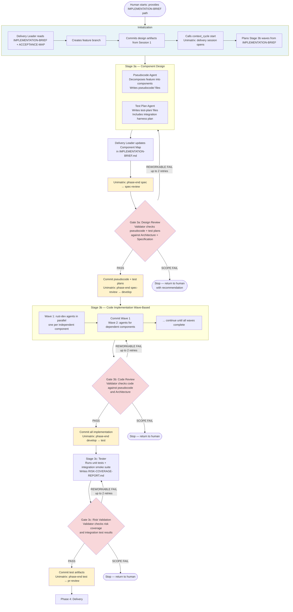
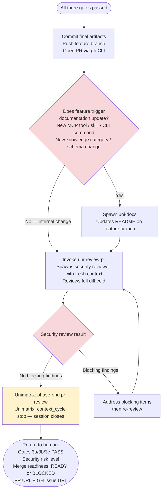

# Delivery Session (Session 2) — Workflow Guide

A Delivery Session takes the design artifacts from Session 1 and implements, tests, and ships the feature. It runs autonomously through three stages with mandatory validation gates between each. The human re-enters only for scope failures, rework exhaustion, or final PR approval.

**Prerequisite**: `product/features/{feature-id}/IMPLEMENTATION-BRIEF.md` must exist. If it does not, run a Design Session first.

**What it produces**: Implemented code, tests, gate reports, PR, and security review.

---

## Stage Flow (Overall)

---

## Phase 4 — Delivery Detail

---

## Rework Protocol

Every gate can produce three outcomes:

| Result | What happens |
|--------|-------------|
| **PASS** | Proceed to next stage. Phase-end recorded in Unimatrix. |
| **REWORKABLE FAIL** | Re-spawn the previous stage's agents with the gate report. Max 2 retries per gate. On third failure, escalate to SCOPE FAIL. |
| **SCOPE FAIL** | Session stops immediately. Return to human: which gate failed, why, and recommendation (adjust scope / revise design / approve modified approach). |

---

## Unimatrix Integration Points

| Moment | Unimatrix Call | Purpose |
|--------|---------------|---------|
| Session start | `context_cycle(type: "start", next_phase: "spec")` | Opens delivery session attribution |
| Stage 3a complete | `context_cycle(type: "phase-end", phase: "spec", next_phase: "spec-review")` | Records pseudocode/test-plan phase |
| Gate 3a PASS | `context_cycle(type: "phase-end", phase: "spec-review", next_phase: "develop")` | Records design gate pass |
| Gate 3b PASS | `context_cycle(type: "phase-end", phase: "develop", next_phase: "test")` | Records code gate pass |
| Gate 3c PASS | `context_cycle(type: "phase-end", phase: "test", next_phase: "pr-review")` | Records test gate pass |
| Phase 4 complete | `context_cycle(type: "phase-end", phase: "pr-review")` then `context_cycle(type: "stop")` | Closes the feature cycle opened in Session 1 |
| All agents — before starting work | `context_briefing(...)` + `context_search(...)` | Agents retrieve relevant ADRs and patterns before implementing |

**Key**: The `context_cycle(type: "stop")` at the end of Phase 4 closes the cycle that was opened in Session 1. The full feature lifecycle — from scope through delivery — is recorded as a single cycle.

---

## Stage 3b Wave Planning

Before spawning any implementation agents, the Delivery Leader reads the IMPLEMENTATION-BRIEF and groups components into dependency waves:

- **Wave 1**: Components with no dependencies on other components in this feature — all run in parallel.
- **Wave 2+**: Components that depend on Wave 1 outputs — run after Wave 1 is committed.

> [!NOTE]
> **Context window management**: Each rust-dev agent receives the full Architecture and Specification (so it understands the whole system) plus only *its own component's* pseudocode and test plan. Agents are not given every component's pseudocode — this is intentional. It prevents context overflow and keeps each agent focused on its specific implementation contract. The component breakdown produced by the Architect in Session 1 directly determines how implementation work is partitioned here.

> [!NOTE]
> **Artifact strategy in Delivery**: Pseudocode, test plans, gate reports, and the risk coverage report are written as Markdown files in `product/features/{id}/`. Reusable patterns, updated procedures, and lessons discovered during implementation are stored in Unimatrix by the retro session after merge — not during delivery itself.

Agents do not run integration tests — that is Stage 3c.

---

## What the Human Receives

At the end of Phase 4:

- Gate results: 3a PASS, 3b PASS, 3c PASS
- Security review: risk level and summary
- Merge readiness: READY or BLOCKED (with blocking items listed)
- PR URL and GitHub Issue URL (updated with gate comments throughout)

**Human action required**: Approve and merge, or address any blocking security findings.
