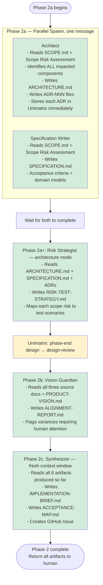

# Design Session (Session 1) — Workflow Guide

A Design Session takes a feature idea from human intent to a full set of implementation-ready artifacts. It runs entirely in `product/features/{feature-id}/` — no code changes, no git commits. The human receives eight documents at the end and decides whether to proceed to a Delivery Session.

**What it produces**: SCOPE.md, SCOPE-RISK-ASSESSMENT.md, ARCHITECTURE.md + ADR files, SPECIFICATION.md, RISK-TEST-STRATEGY.md, ALIGNMENT-REPORT.md, IMPLEMENTATION-BRIEF.md, ACCEPTANCE-MAP.md, and a GitHub Issue.

---

## Phase Flow (Overall)

```mermaid
flowchart TD
    H([Human provides feature intent]) --> INIT

    INIT[Design Leader reads protocol\nCalls context_cycle start\nUnimatrix: session opens]

    INIT --> P1[Phase 1: Researcher explores\nproblem space and writes SCOPE.md]
    P1 --> APPROVE{Human reviews\nSCOPE.md\nconsults /uni-zero}
    APPROVE -->|Rejected — revise| P1
    APPROVE -->|Approved| P1B

    P1B[Phase 1b: Risk Strategist — scope mode\nWrites SCOPE-RISK-ASSESSMENT.md]
    P1B --> CYCLE1[Unimatrix: phase-end scope → design]
    CYCLE1 --> P2A

    P2A[Phase 2a: Architect + Specification Writer\nin parallel — see Phase 2 detail below]
    P2A --> P2APLUS[Phase 2a+: Risk Strategist — architecture mode\nWrites RISK-TEST-STRATEGY.md]
    P2APLUS --> CYCLE2[Unimatrix: phase-end design → design-review]
    CYCLE2 --> P2B[Phase 2b: Vision Guardian\nWrites ALIGNMENT-REPORT.md]
    P2B --> P2C[Phase 2c: Synthesizer — fresh context\nWrites IMPLEMENTATION-BRIEF.md + ACCEPTANCE-MAP.md\nCreates GitHub Issue]
    P2C --> P2D[Unimatrix: phase-end design-review → spec\nNote: cycle stays open for Session 2]
    P2D --> RETURN([Human receives all 8 artifacts\nand GitHub Issue URL])

    RETURN --> DECIDE{Human decision\nconsults /uni-zero}
    DECIDE -->|Proceed| SESS2([Start Delivery Session])
    DECIDE -->|Revise scope| P1
    DECIDE -->|Defer| HOLD([Feature parked])

    style INIT fill:#e8f4f8
    style CYCLE1 fill:#fff3cd
    style CYCLE2 fill:#fff3cd
    style P2D fill:#fff3cd
    style APPROVE fill:#f8d7da
    style DECIDE fill:#f8d7da
```

---

## Phase 2 — Agent Detail

Phase 2a runs two specialists in parallel. All subsequent Phase 2 steps are sequential.

---

## Artifact Strategy: Files vs. Unimatrix

> [!NOTE]
> **Two-tier artifact model**: All design artifacts are written as Markdown files in `product/features/{feature-id}/` — these drive the feature workflow (agents read them, gates validate them, humans review them). Unimatrix stores a parallel layer of knowledge that future agents across *any* feature can retrieve by semantic search: ADRs, patterns, conventions, and lessons. Files are workflow artifacts; Unimatrix is the living knowledge base.

| Artifact | Where it lives | Why |
|----------|---------------|-----|
| SCOPE.md, ARCHITECTURE.md, SPECIFICATION.md, etc. | `product/features/{id}/` as Markdown files | Drives this feature's workflow; reviewed by humans and gates |
| Each ADR | Both: file in `architecture/` + Unimatrix entry | File for human review; Unimatrix entry so delivery agents find decisions by search without reading every file |
| Patterns, conventions, lessons | Unimatrix only | Accumulated knowledge reusable across all future features — not tied to one feature's directory |

---

## Unimatrix Integration Points

| Moment | Unimatrix Call | Purpose |
|--------|---------------|---------|
| Session start | `context_cycle(type: "start", next_phase: "scope")` | Opens the feature cycle; all subsequent tool calls are attributed to this feature |
| Phase 1 complete | `context_cycle(type: "phase-end", phase: "scope", next_phase: "design")` | Records scope phase completion |
| Phase 2a+ complete | `context_cycle(type: "phase-end", phase: "design", next_phase: "design-review")` | Records design phase completion |
| After each ADR is written (Architect) | `context_store(category: "decision", ...)` | ADR stored in Unimatrix so delivery agents can find it by search — not by reading files |
| Session end | `context_cycle(type: "phase-end", phase: "design-review", next_phase: "spec")` | Cycle stays open — Delivery Session will close it |
| All agents — before starting work | `context_briefing(task: "...")` | Agents orient themselves against prior decisions and conventions before designing |

**Key**: The cycle is NOT closed at the end of Design. It remains open so that Delivery Session events are attributed to the same feature cycle.

---

## What the Human Receives

At the end of Phase 2d, the Design Leader returns:

- Links to all eight artifact files in `product/features/{feature-id}/`
- GitHub Issue URL
- Vision alignment summary (any variances requiring approval)
- Open questions (if any)

**Human action required**: Review the artifacts. Then start a Delivery Session to implement.
