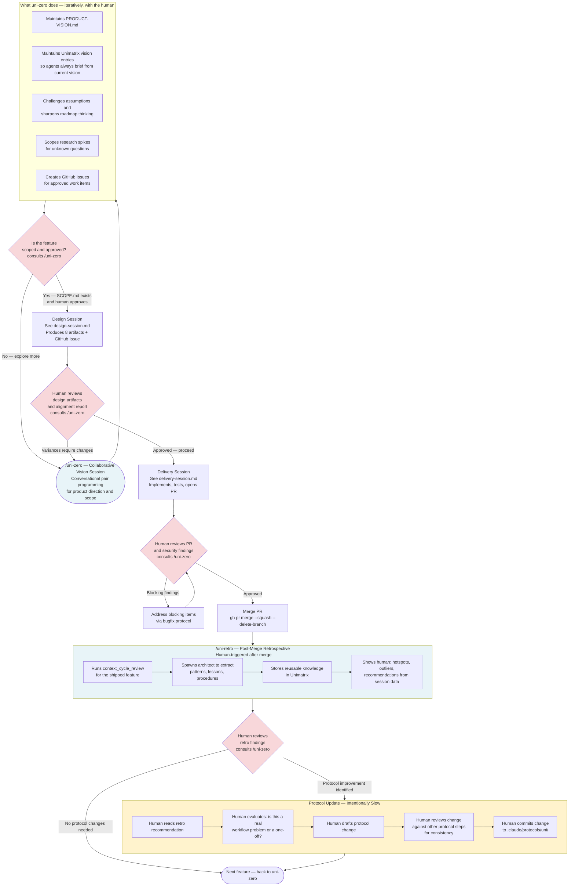

# PM Governance — How the Whole System Fits Together

This diagram shows the human-driven governance layer that wraps the automated swarm sessions. Understanding this layer explains how the project stays on-vision, how workflow problems get fixed, and why protocol changes are intentionally slow.

> [!NOTE]
> **uni-zero is pair programming for product vision.** It is not a report generator or an advisory tool you query and dismiss. It is a collaborative, iterative thinking partner: you bring a half-formed idea, a concern, a strategic question, or a draft roadmap — uni-zero pushes back, surfaces implications, proposes alternatives, and helps you sharpen the thinking before any feature work begins. Sessions are conversational and can span multiple rounds. The output is a clearer vision, a scoped research spike, a GitHub Issue, or a refined roadmap — not a document summary.

---

## The Governance Loop

---

## Why Each Step Is Human-Driven

| Step | Why human, not automated |
|------|--------------------------|
| Vision alignment (uni-zero) | Product direction requires judgment — the system cannot decide what to build |
| Design artifact review | Variances in the alignment report may require scope changes, not just acknowledgment |
| PR review and merge | Security findings may require human judgment on acceptable risk |
| Retro review | Hotspot data requires context: is a pattern a real problem or a measurement artifact? |
| Protocol updates | Changing the protocols changes how all future sessions run — this requires deliberate human approval, not automated feedback loops |

---

## What uni-zero Does NOT Do

- Does not modify code in `crates/`
- Does not run Design, Delivery, or Bugfix protocols
- Does not create feature implementation artifacts (IMPLEMENTATION-BRIEF, ARCHITECTURE.md, etc.)
- Does not commit or push code
- Does not store ADRs, patterns, or lessons in Unimatrix (those belong to delivery and retro sessions)

uni-zero is purely strategic: vision, roadmap, scope, research spike initiation, and GitHub Issue creation.

---

## What uni-retro Does NOT Do

- Does not change protocols automatically based on hotspot recommendations
- Does not merge PRs
- Does not create new features or GitHub Issues
- Does not supersede ADRs without human approval

uni-retro extracts knowledge from shipped work and presents findings to the human. The human decides what to act on.

---

## Why Protocol Changes Are Intentionally Slow

Protocols define how every future swarm session runs. An automated feedback loop from retro findings to protocol edits would mean one bad session could corrupt the workflow for all subsequent sessions. Protocol changes require the human to:

1. Read the recommendation and validate it against multiple sessions (not just one)
2. Trace the change through the protocol to check for side effects
3. Confirm the change doesn't break gate dependencies or agent role boundaries

This is not a limitation — it is the control mechanism that keeps the swarm system trustworthy.
