# Proposed Flow: Phased Protocol Delivery via Unimatrix

## Current vs Proposed

**Current**: Scrum-master reads entire protocol file from disk at spawn. Both sessions'
instructions in one load. Protocol is a static file.

**Proposed**: Unimatrix delivers protocol in phases. Session 1 protocol includes a
directive to retrieve Session 2 on completion. Context window stays lean. Each session's
protocol is an independent, versioned Unimatrix entry.

## Key Design Principle

**Pull, don't dump.** The agent gets what it needs for the current phase, with a
pointer to the next phase. This is lazy loading for workflow context.

```mermaid
flowchart TD
    %% ── Human trigger ──
    H["Human: 'Let's build col-002'"]

    %% ── Layer 1: CLAUDE.md ──
    subgraph L1["Layer 1: CLAUDE.md"]
        R1["Rule: feature work → spawn uni-scrum-master"]
    end

    %% ── Platform spawn ──
    SPAWN["Task(uni-scrum-master)<br/>prompt: col-002, design session"]

    %% ── Layer 2: Agent def (thinner) ──
    subgraph L2["Layer 2: Agent Def (identity + skeleton)"]
        ID["Identity: coordinator"]
        ORIENT["Orientation: retrieve protocol<br/>from Unimatrix for session type"]
        CHOREO["Retained: role boundaries,<br/>gate management, exit gate"]
    end

    %% ── Unimatrix pull 1 ──
    PULL1["context_search(<br/>  category: 'procedure',<br/>  query: 'design session protocol'<br/>)"]

    %% ── Session 1 from Unimatrix ──
    subgraph S1["Unimatrix Entry: Session 1 Protocol"]
        S1_PHASES["Phase 1: spawn researcher → SCOPE.md<br/>Phase 1b: spawn risk-strategist (scope)<br/>Phase 2a: spawn architect + specification<br/>Phase 2a+: spawn risk-strategist (arch)<br/>Phase 2b: spawn vision-guardian<br/>Phase 2c: spawn synthesizer"]
        S1_END["END DIRECTIVE:<br/>'Session 1 complete. Return artifacts to human.<br/>Human decides whether to proceed.<br/>For Session 2: retrieve delivery protocol<br/>from Unimatrix.'"]
    end

    %% ── Human checkpoint ──
    CHECKPOINT["Human reviews Session 1 artifacts<br/>Decides: proceed to Session 2?"]

    %% ── New conversation / session ──
    SPAWN2["New session: Task(uni-scrum-master)<br/>prompt: col-002, delivery session"]

    %% ── Agent def loads again ──
    L2B["Layer 2: Agent Def loads again<br/>(same file, fresh context)"]

    %% ── Unimatrix pull 2 ──
    PULL2["context_search(<br/>  category: 'procedure',<br/>  query: 'delivery session protocol'<br/>)"]

    %% ── Session 2 from Unimatrix ──
    subgraph S2["Unimatrix Entry: Session 2 Protocol"]
        S2_STAGES["Stage 3a: spawn pseudocode + tester<br/>Update Component Map<br/>Gate 3a: spawn validator<br/>Stage 3b: spawn rust-dev per component<br/>Gate 3b: spawn validator<br/>Stage 3c: spawn tester (execution)<br/>Gate 3c: spawn validator"]
        S2_END["END DIRECTIVE:<br/>'Session 2 complete. Open PR.<br/>Record outcome in Unimatrix.'"]
    end

    %% ── Connections ──
    H --> L1
    L1 --> SPAWN
    SPAWN -->|"platform-native"| L2
    L2 -->|"agent retrieves protocol"| PULL1
    PULL1 -->|"Unimatrix delivers<br/>Session 1 only"| S1
    S1 --> CHECKPOINT
    CHECKPOINT -->|"human approves"| SPAWN2
    SPAWN2 -->|"platform-native"| L2B
    L2B -->|"agent retrieves protocol"| PULL2
    PULL2 -->|"Unimatrix delivers<br/>Session 2 only"| S2

    %% ── Styling ──
    style L1 fill:#1a1a2e,stroke:#e94560,color:#fff
    style L2 fill:#1a1a2e,stroke:#0f3460,color:#fff
    style L2B fill:#1a1a2e,stroke:#0f3460,color:#fff
    style S1 fill:#16213e,stroke:#0f3460,color:#fff
    style S2 fill:#16213e,stroke:#533483,color:#fff
    style H fill:#e94560,color:#fff
    style CHECKPOINT fill:#e94560,color:#fff
    style SPAWN fill:#0f3460,color:#fff
    style SPAWN2 fill:#533483,color:#fff
    style PULL1 fill:#0f3460,color:#fff
    style PULL2 fill:#533483,color:#fff
```



## What changes in each layer

### Layer 1: CLAUDE.md — No change
Rule stays: "feature work uses swarms → spawn uni-scrum-master"

### Layer 2: Agent def — Gets thinner
**Remove**: Protocol file paths, session-specific workflow detail
**Retain**: Identity, role boundaries, gate management mechanics, exit gate checklist
**Add**: Orientation directive to pull protocol from Unimatrix

```markdown
## Orientation

At session start, retrieve your protocol:
- context_search(category: "procedure", query: "{session-type} session protocol")
- Read the returned protocol. Execute it phase by phase.
- Do NOT read .claude/protocols/ files.
```

### Layer 3: Protocols — Move to Unimatrix as procedure entries

Two entries replace the protocol files:

| Entry | Topic | Category | Content |
|-------|-------|----------|---------|
| Design Session Protocol | `workflow` | `procedure` | Full Session 1 phases + end directive pointing to Session 2 |
| Delivery Session Protocol | `workflow` | `procedure` | Full Session 2 stages + end directive for outcome recording |

Each entry ends with a **directive** — not just workflow steps, but an explicit
instruction for what to do next:

**Session 1 end directive:**
```
Session 1 is complete. Return all artifact paths to the human.
The human decides whether to proceed to Session 2.

If proceeding to Session 2 (delivery):
  Retrieve the delivery protocol:
  context_search(category: "procedure", query: "delivery session protocol")
```

**Session 2 end directive:**
```
Session 2 is complete. All gates passed.
  1. Open PR via /uni-git conventions
  2. Record outcome: context_store(category: "outcome", feature_cycle: "{feature-id}",
     tags: ["type:feature", "gate:3c", "phase:testing", "result:pass"])
  3. Close GH Issue with summary
```

## What this enables

### 1. Context window efficiency
Session 1 protocol: ~3000 chars. Session 2 protocol: ~4000 chars.
Current: both loaded at once (~7000 chars consumed from context).
Proposed: only the active session's protocol loaded (~3000-4000 chars).

### 2. Independent versioning
Session 1 protocol can be corrected (`context_correct`) without touching Session 2.
Each has its own confidence score, usage tracking, correction chain.

### 3. Chained retrieval pattern
The "end directive" creates a **linked list of workflow phases**:
```
Session 1 entry → end directive → "retrieve Session 2"
Session 2 entry → end directive → "record outcome"
```
This is extensible. A future Session 3 (maintenance?) just adds another link.

### 4. Protocol discovery
New coordinators don't need hardcoded file paths. They search:
```
context_search(category: "procedure", query: "how to run a design session")
```
The right protocol surfaces by semantic relevance.

## What this does NOT solve

- **Ordering within a session** — The protocol entry itself must contain ordered steps.
  Unimatrix delivers the blob; the ordering lives inside the content, not in metadata.
- **Conditional branching** — "If REWORKABLE FAIL → rework" logic stays in the protocol
  content or agent def. Unimatrix doesn't execute conditionals.
- **Human checkpoint enforcement** — The "human approves SCOPE.md" step is a convention
  in the protocol text. Nothing in Unimatrix enforces it.

## Comparison: Current vs Proposed

| Aspect | Current (file-read) | Proposed (Unimatrix) |
|--------|--------------------|--------------------|
| Protocol storage | `.claude/protocols/uni/*.md` | Unimatrix `procedure` entries |
| Loading | Read entire file at spawn | Pull per-session on demand |
| Versioning | Git commits | Correction chains + confidence |
| Discovery | Hardcoded file path in agent def | Semantic search by intent |
| Context cost | ~7000 chars (both sessions) | ~3000-4000 chars (one session) |
| Tracking | None | Usage count, helpfulness, co-access |
| Update flow | Edit file, commit, merge | `context_correct` — instant, auditable |
| Sequencing | Top-to-bottom in file | Top-to-bottom in entry content + end directive |

## Implementation path

1. Store Session 1 and Session 2 protocols as separate `procedure` entries
2. Add end directives with retrieval instructions
3. Update uni-scrum-master agent def: replace file path with Unimatrix retrieval
4. Remove `.claude/protocols/uni/uni-design-protocol.md` and `uni-delivery-protocol.md`
5. Keep `.claude/protocols/uni/uni-bugfix-protocol.md` (or migrate it too)
6. Keep `.claude/protocols/uni/uni-agent-routing.md` (reference, not a workflow)
