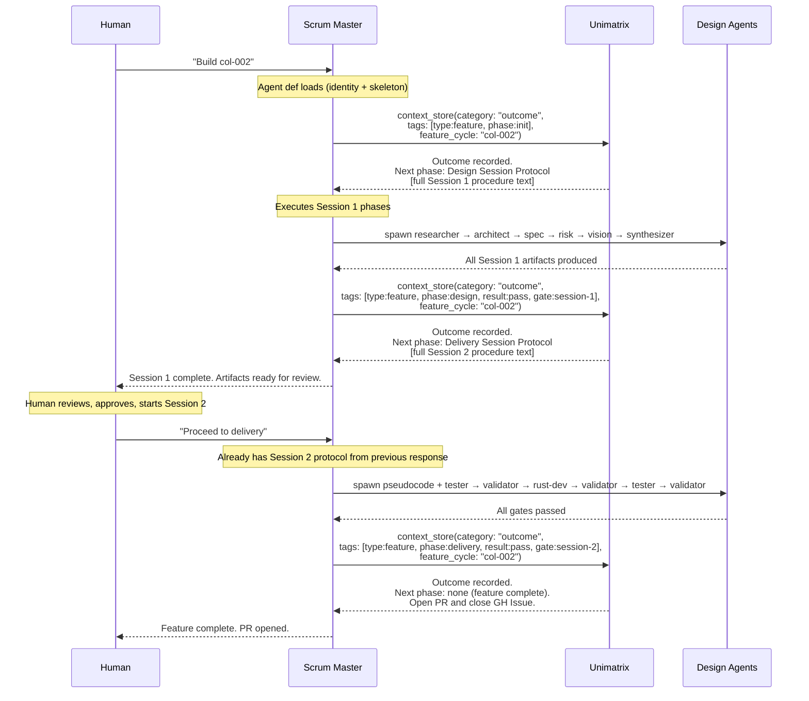

# Reactive Flow: Outcome Recording Triggers Next Phase

## Evolution of the Design

```
v1 (current):   Read entire protocol file from disk at spawn
v2 (pull):      Agent explicitly retrieves each session's protocol from Unimatrix
v3 (reactive):  Recording an outcome automatically returns the next workflow phase
```

v3 is the target. The agent doesn't need to know what comes next — Unimatrix does.

## The Core Idea

```
Agent records:   "design session complete, result: pass"
Unimatrix says:  "Outcome recorded. Here is your next phase:"
                 + full delivery session protocol
```

One MCP call. Two effects. Zero "go fetch the next thing" directives.



## How It Works: Workflow Graph in Unimatrix

### Procedure entries with `next_phase` metadata

Each procedure entry includes a tag or field that declares what outcome triggers it:

| Entry | Category | Tags | Triggered by |
|-------|----------|------|-------------|
| Design Session Protocol | procedure | `phase:design`, `trigger:phase:init+result:pass` | Outcome with phase=init, result=pass |
| Delivery Session Protocol | procedure | `phase:delivery`, `trigger:phase:design+result:pass` | Outcome with phase=design, result=pass |
| Feature Complete Directive | procedure | `phase:complete`, `trigger:phase:delivery+result:pass` | Outcome with phase=delivery, result=pass |
| Rework Directive | procedure | `phase:rework`, `trigger:result:rework` | Any outcome with result=rework |

### Server-side logic (in context_store for outcomes)

```
When category == "outcome":
  1. Validate and store the outcome (existing behavior)
  2. Extract phase + result from structured tags
  3. Lookup: find procedure entry where trigger tag matches (phase + result)
  4. If found: append procedure content to response
  5. If not found: append "No next phase. Workflow complete."
```

This is a lightweight addition to the existing outcome storage path — one extra
lookup after the write.

## What the Scrum Master Agent Def Becomes

```markdown
# Unimatrix Scrum Master

You are the swarm coordinator. You don't read protocol files — Unimatrix
delivers your workflow phases reactively.

## Orientation

To start a session, record an init outcome:
  context_store(category: "outcome",
    tags: ["type:feature", "phase:init"],
    feature_cycle: "{feature-id}",
    content: "Starting {session-type} for {feature-id}")

Unimatrix responds with your protocol. Execute it.

When you complete a phase, record the outcome:
  context_store(category: "outcome",
    tags: ["type:feature", "phase:{current}", "result:{pass|fail}"],
    feature_cycle: "{feature-id}",
    content: "{summary of what was produced}")

Unimatrix responds with the next phase. Execute it.

If no next phase is returned, the workflow is complete.

## Retained in agent def (NOT in Unimatrix)
- Role boundaries table (you orchestrate, never generate)
- Gate management mechanics (PASS/REWORKABLE FAIL/SCOPE FAIL)
- Component Map update procedure (critical handoff)
- Exit gate checklist
- GH Issue lifecycle
```

## Advantages Over v2 (Pull Model)

| Aspect | v2 (Pull) | v3 (Reactive) |
|--------|-----------|---------------|
| Agent knowledge | Must know to search for next phase | Just records what happened |
| Directives | End-of-protocol "go fetch next" text | None needed |
| Coupling | Agent knows phase names to search for | Agent only knows current outcome |
| Trigger | Agent decides when to pull | Outcome recording IS the trigger |
| Workflow graph | Implicit in directive text | Explicit in procedure entry tags |
| Extensibility | Edit directive text to add phases | Add a procedure entry with trigger tag |
| Failure path | Agent must know to search for rework procedure | Outcome with result=rework triggers rework procedure |
| Tracking | Two calls: store outcome + search procedure | One call: store outcome, get procedure |

## Implementation Scope

### Server changes (crates/unimatrix-server)
1. **Outcome response enrichment**: After storing an outcome entry, lookup the next
   procedure by matching `trigger:` tags against the outcome's phase+result tags.
   Append the procedure content to the `context_store` response.

2. **Trigger tag convention**: New structured tag prefix `trigger:` that encodes
   the (phase, result) pair that activates this procedure. Validated alongside
   existing structured tags (type, gate, phase, result, agent, wave).

### Data changes (Unimatrix entries)
1. Store Session 1 protocol as procedure entry with `trigger:phase:init+result:pass`
2. Store Session 2 protocol as procedure entry with `trigger:phase:design+result:pass`
3. Store completion directive with `trigger:phase:delivery+result:pass`
4. Store rework directive with `trigger:result:rework`
5. Optionally: bugfix protocol with `trigger:type:bugfix+phase:init`

### Agent def changes
1. Slim uni-scrum-master: remove protocol file paths, add orientation section
2. Slim uni-bugfix-manager: same pattern
3. Remove `.claude/protocols/uni/uni-design-protocol.md` (migrated to Unimatrix)
4. Remove `.claude/protocols/uni/uni-delivery-protocol.md` (migrated to Unimatrix)
5. Keep `.claude/protocols/uni/uni-agent-routing.md` (reference table, not a workflow)

## Open Questions

1. **Rework loops**: When Gate 3a fails, the outcome is `result:rework`. Should the
   rework procedure be a separate entry, or should the delivery protocol include
   rework instructions inline? (Probably inline — rework is part of the delivery flow.)

2. **Human checkpoint**: Session 1 → Session 2 requires human approval. The reactive
   response includes the delivery protocol, but the scrum master should wait for
   human before executing it. The protocol text should say so, but nothing enforces it.

3. **Concurrent features**: If two features are in-flight, outcome recording must be
   scoped by `feature_cycle`. The trigger lookup should also be feature-scoped to
   avoid cross-contamination.

4. **Trigger specificity**: `trigger:phase:design+result:pass` is simple but rigid.
   What about `trigger:phase:design+result:pass+type:feature` vs
   `trigger:phase:design+result:pass+type:bugfix`? Need to decide on matching rules
   (exact match? partial match? most-specific-wins?).
