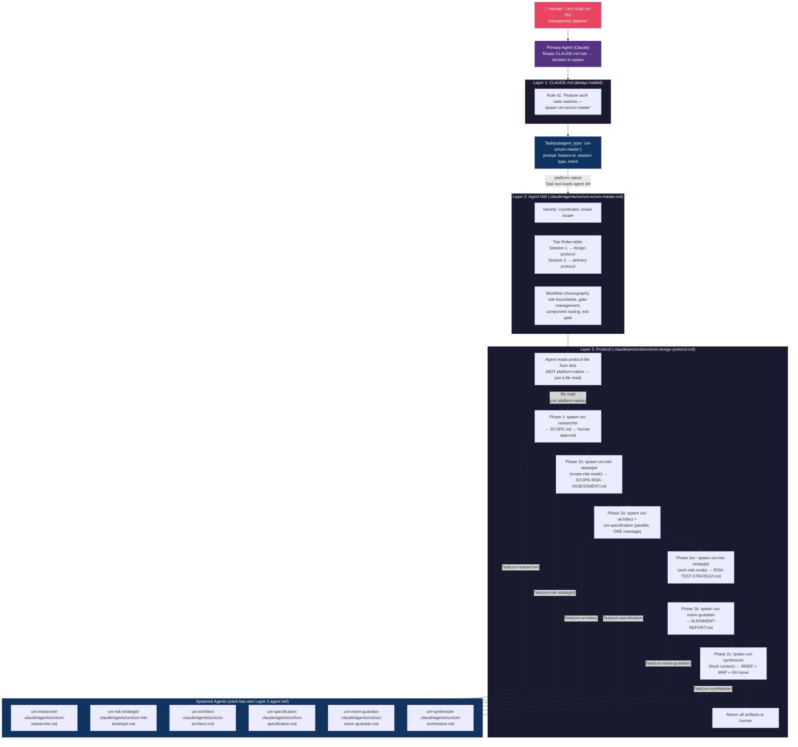

# Trigger Flow: "Start a new feature"

Traces the full activation chain from a human saying "let's build col-002" through
CLAUDE.md rules, protocol selection, agent spawning, and artifact production.

## Key Insight

There are **3 trigger layers** and **2 handoff types**:

- **Layer 1: CLAUDE.md** — Static rules loaded into every conversation. Contains the
  initial routing rule ("feature work uses swarms → spawn uni-scrum-master").
- **Layer 2: Agent def** — Loaded when Claude spawns the agent via Task tool. Contains
  role identity + workflow choreography + protocol file path.
- **Layer 3: Protocol** — Read from disk BY the agent at runtime. Contains the
  detailed phase-by-phase execution steps.

Handoff types:
- **Platform-native**: Claude Code's Task tool spawns agents from `.claude/agents/` defs
- **File-read**: Agent reads `.claude/protocols/` from disk (no platform support)



## Trigger Analysis

### What triggers what

| Step | Trigger | Mechanism | Source |
|------|---------|-----------|--------|
| 1 | Human says "build col-002" | Natural language intent | Human |
| 2 | Claude decides to spawn swarm | CLAUDE.md rule #1 match | `.claude/CLAUDE.md` line 3 |
| 3 | uni-scrum-master loads | `Task(subagent_type)` — platform-native | Claude Code Task tool |
| 4 | Scrum master reads protocol | `Read` tool on file path from agent def | Agent def line 23 → protocol file |
| 5 | Phase 1: researcher spawns | `Task(subagent_type: "uni-researcher")` | Protocol Phase 1 instructions |
| 6 | Human approves SCOPE.md | Human checkpoint (protocol-defined) | Protocol line 18 |
| 7 | Phase 1b: risk strategist spawns | `Task(subagent_type: "uni-risk-strategist")` | Protocol Phase 1b |
| 8 | Phase 2a: architect + spec spawn | Two `Task()` calls in ONE message | Protocol Phase 2a |
| 9 | Phase 2a+: risk strategist respawns | `Task()` with arch-risk mode | Protocol Phase 2a+ |
| 10 | Phase 2b: vision guardian spawns | `Task(subagent_type: "uni-vision-guardian")` | Protocol Phase 2b |
| 11 | Phase 2c: synthesizer spawns | `Task()` with fresh context | Protocol Phase 2c |
| 12 | Return to human | Scrum master returns artifacts | Protocol end |

### The two handoff types

```
Platform-native (reliable, structured):
  Human → Claude → Task(uni-scrum-master) → Task(uni-researcher) → ...
                    ↑                        ↑
                    Agent def loaded          Agent def loaded
                    automatically             automatically

File-read (fragile, convention-based):
  uni-scrum-master → Read(".claude/protocols/uni/uni-design-protocol.md")
                     ↑
                     Agent def says "read this file"
                     but nothing enforces it
```

### Where Unimatrix COULD replace file-reads

The protocol file read (Layer 3) is the non-platform-native handoff. If protocols
were stored as Unimatrix procedure entries:

```
Current:  Agent def says "read .claude/protocols/uni/uni-design-protocol.md"
          → Agent uses Read tool → gets protocol text

Future:   Agent def says "context_search(category: 'procedure', query: 'design session')"
          → Agent uses MCP tool → gets protocol text from Unimatrix
          → Protocol is versioned, tracked, confidence-scored
```

Skills and agent defs stay as files (platform-native triggers).
Protocols could move to Unimatrix (just file reads, no platform dependency).
